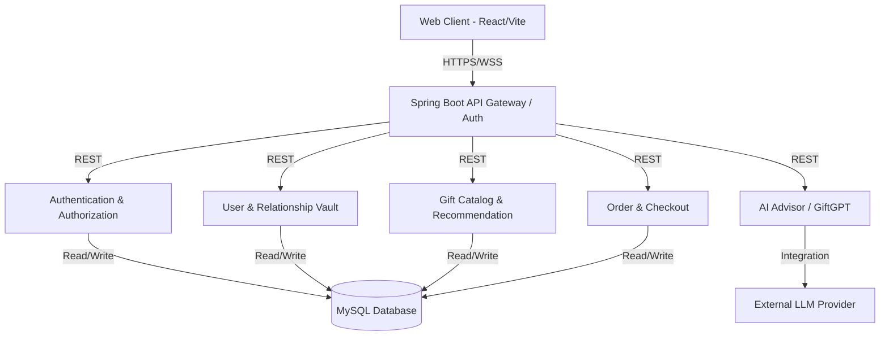
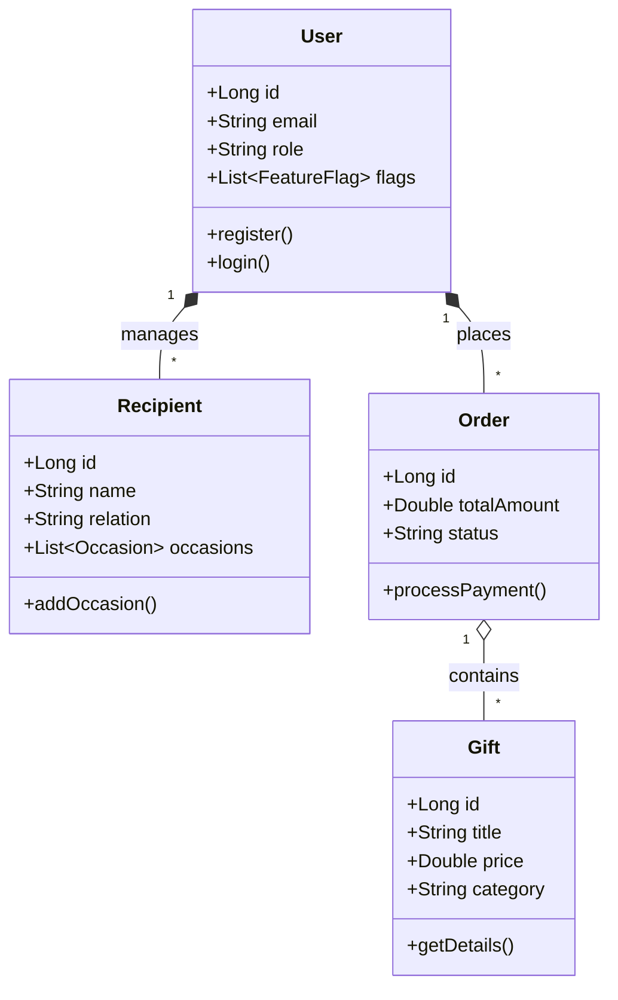
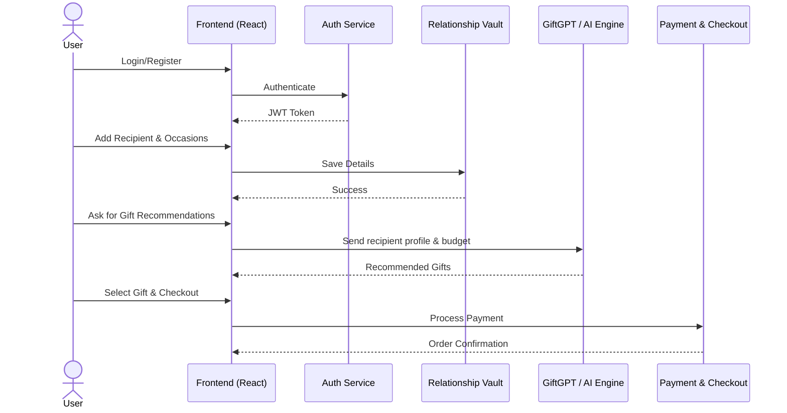
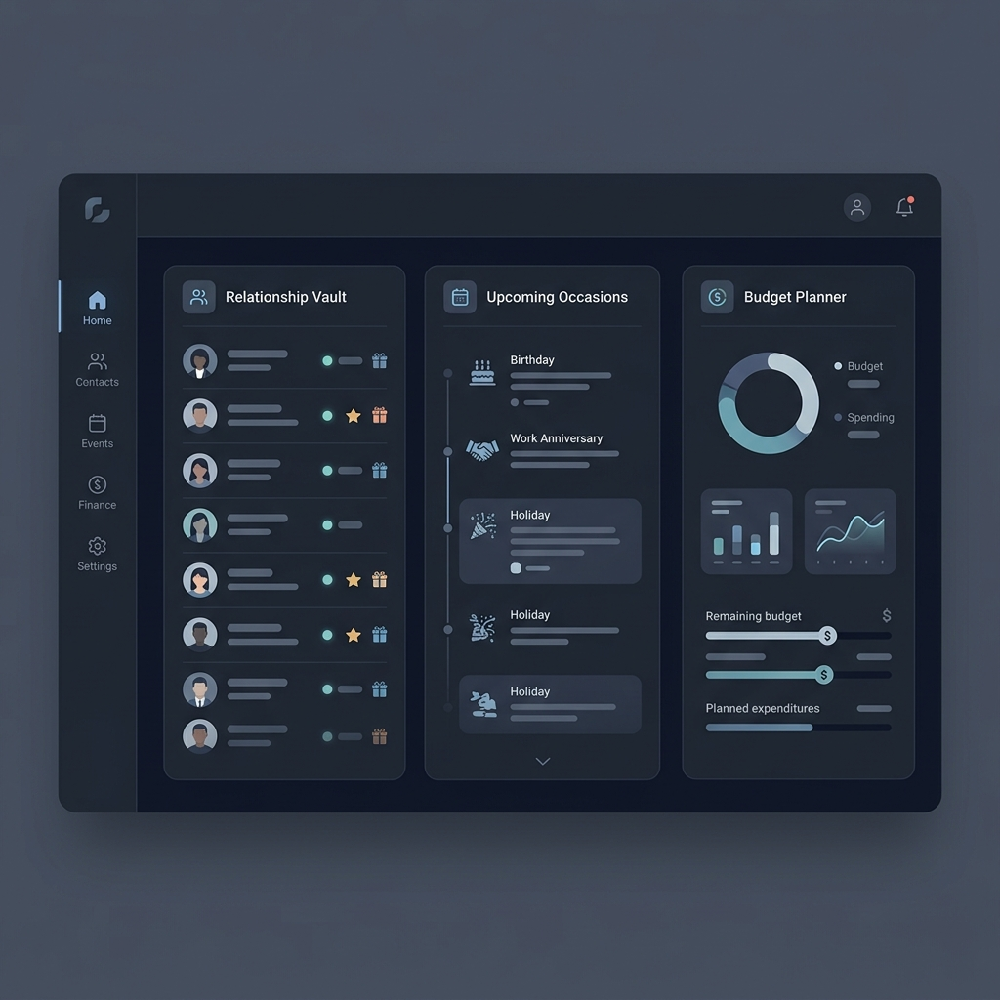
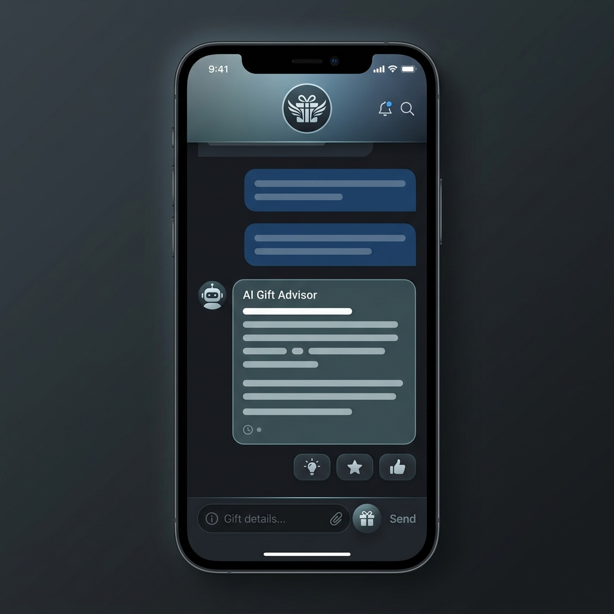
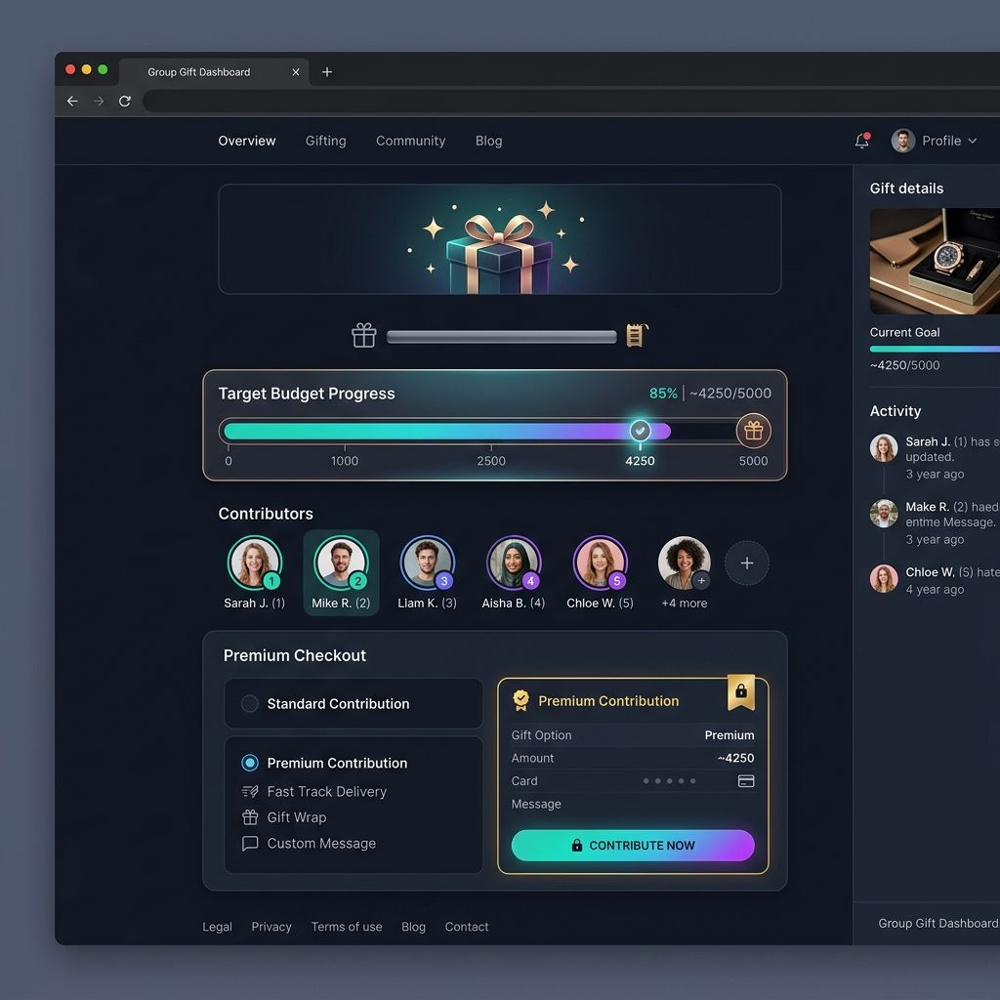

# Corporate Gifting Concierge

An AI-powered, enterprise-grade personal gifting platform that seamlessly blends relationship management, advanced budget planning, and AI-driven gift recommendations.

## 📐 High-Level Design (HLD)

The application follows a modern monolithic architecture with a clear separation between the React-based frontend and the Spring Boot backend.

## 🏗️ Low-Level Design (LLD)

Core entity relationships ensuring data consistency and optimal performance.

## 🔄 Application Workflow

A fully functional sequence of how the application operates from user authentication to gift checkout.

## ✨ In-Depth Feature Breakdown

### 1. Dashboard & Relationship Vault
The central hub of the application. It acts as a comprehensive CRM for personal relationships. Users can store details about their colleagues, clients, and loved ones, tracking important dates such as work anniversaries, birthdays, and corporate milestones.
- **Budget Planner:** Set and track your gifting budget for the fiscal year or specific periods.
- **Future Locker:** Schedule gifts to be sent in the future automatically.
- **Occasion Calendar:** A unified view of all upcoming gifting events.

### 2. AI Advisor (GiftGPT & Gift Detective)
A state-of-the-art conversational AI that acts as your personal shopping assistant.
- **GiftGPT:** Chat directly with the AI to find the perfect gift based on personality, corporate policies, and budget.
- **Gift Detective:** Unsure what to buy? Answer a few dynamic quiz questions and let the system pinpoint the optimal gift.

### 3. Collaborative Gifting & Wishlists
Built for team environments where multiple people chip in for a single gift.
- **Group Gifting:** Create a collective pot. Invite contributors to add funds, track progress in real-time, and purchase a premium gift collectively.
- **Secret Santa:** Automate office gift exchanges with sophisticated matching algorithms.
- **Gift Stories:** Share the joy with an internal social feed of received and given corporate gifts.

### 4. Enterprise Admin Panel
A powerful backend management system accessible only to administrators.
- **Catalog Management:** Add, remove, or modify gifts.
- **Analytics:** View detailed reports on popular gifts, total spending, and user engagement.
- **Order Processing:** Track the status of deliveries and manage customer service inquiries.

### 5. Emotion & Occasion Search
An intuitive search engine that allows users to find gifts not just by category (e.g., "Mugs") but by emotion (e.g., "Gratitude", "Sympathy", "Celebration").

## 🛠️ Technology Stack
- **Frontend:** React 18, Vite, Tailwind CSS / Custom CSS, Zustand (State Management)
- **Backend:** Java 21, Spring Boot 3.3.6, Spring Security, JPA/Hibernate
- **Database:** MySQL
- **Security:** JWT (JSON Web Tokens) based authentication

## 🚀 Getting Started
*Note: Ensure you have your own secure environment variables configured. No default credentials are provided in this repository for security purposes.*

1. **Clone the repository.**
2. **Setup the Database:** Create a MySQL schema named `corporate_gifting`.
3. **Backend Setup:** Navigate to `backend/` and run `mvn spring-boot:run`.
4. **Frontend Setup:** Navigate to `frontend/`, run `npm install`, and then `npm run dev`.
